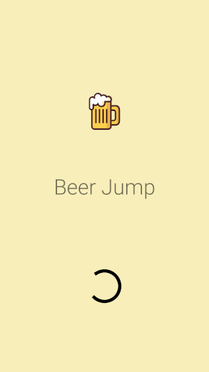
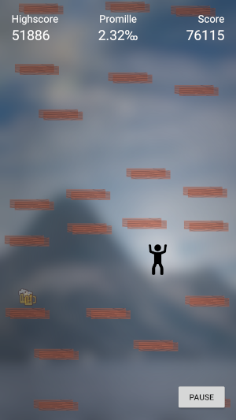

# Beer Jump

## Projektbeschreibung

### Team
- Nils Mathys – [mathynil](mailto:mathynil@students.zhaw.ch)
- Dominic Gisler – [gisledom](mailto:gisledom@students.zhaw.ch)
- Leo Meier – [meierleo](mailto:meierleo@students.zhaw.ch)

### Idee
Unser Projekt soll an das Spiel «Doodle Jump» (und ähnliche Spiele) angelehnt sein. Für die Entwicklung werden wir eine native App entwickeln. Der Name unseres Spiels ist «Beer Jump» und dieser Name ist Programm.

Der Spieler muss wie bei anderen Spielen möglichst weit in die Höhe kommen. Unterwegs können Bierflaschen eingesammelt werden (wie Münzen bei anderen Spielen). Diese haben zwei verschiedene Funktionen: zum einen stellen sie einen Multiplikator der Punkte dar, zum anderen wird aber auch ein Negativeffekt stattfinden.

Dieser Negativeffekt beinhaltet eine erschwerte Sicht (doppeltes Sehen), sowie einen Tunnelblick. Diese Effekte werden bei höherer Promillezahl stärker.

### Plattform

Android native (Kotlin)

### Wireframes

### Mockup

### Screenshots

